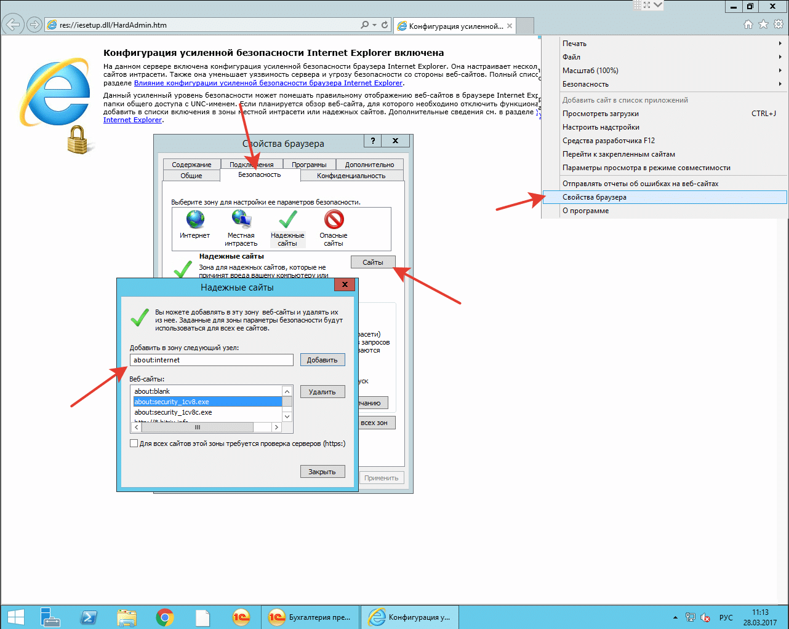

# Содержимое указанного ниже веб-узла в этом приложении блокировано конфигурацией усиленной безопасности `Internet Explorer security_1cv8c.exe`

## Ошибка блокировки конфигурацией усиленной безопасности Internet Explorer 

При работе с отправкой сообщений из 1С используется интернет.  

Часто возникает вот такая ошибка *«Содержимое указанного ниже веб-узла в этом приложении блокировано конфигурацией усиленной безопасности Internet Explorer».*
И указан узел `security_1cv8c.exe` или `security_1cv8.exe.` Ошибка возникает не только при отправке СМС, как вы наверное уже поняли.  
Она возникает по факту использования интернета и блокирования работы программы, которая пытается его использовать со стороны операционной системы (ОС).  
Чаще всего встречается в серверных ОС.  

Решение проблемы:  

Добавьте в исключение в настройках безопасности Internet Explorer. 

Необходимо открыть **Internet Explorer > Свойства браузера (обозревателя) > Безопасность > Надёжные сайты (узлы) и добавляете about:security_1cv8c.exe и about:security_1cv8.exe,** нажимаете **Ок**. Проблема решена.

