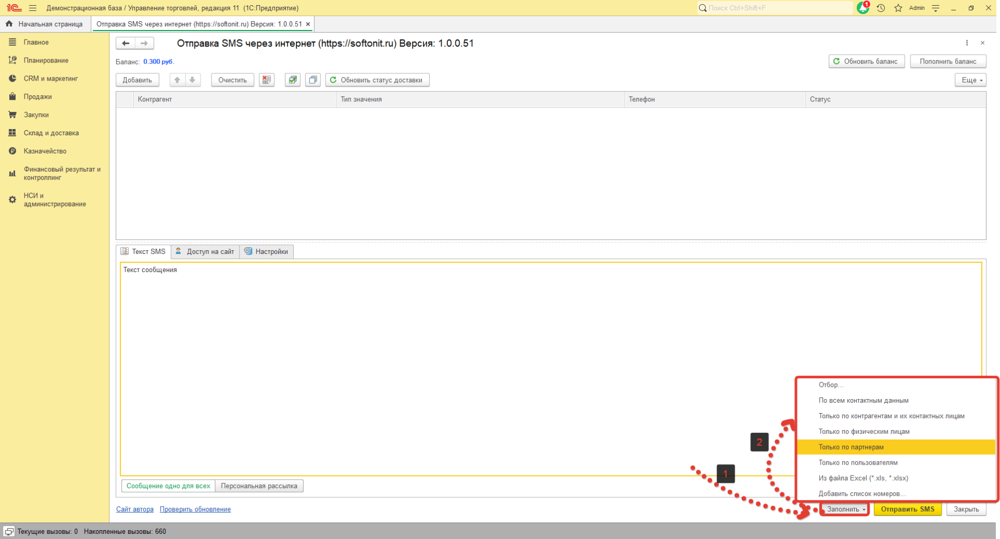

# Работа с сервисом sms-prosto.ru

### Рассмотрим работу с обработкой на примере сервиса ProstoSMS(https://sms-prosto.ru/).

Запустим нашу обработку.  
Перед нами открылось окно обработки где видим три основные вкладки и поле для заполнения получателей.

Первым делом перейдем на вкладку `"Доступ на сайт"` и в поле `"Сервис"` выберем **"sms-prosto.ru"**

После чего заполним  поля **"Логин"**, **"Пароль"**, **"Отправитель"**(Он должен соответствовать отправителю созданному в личном кабинете сервиса), **"Ключ API"**. Обращу внимание что обработка сразу пытается работать через **"КлючAPI"**, если же данное поле не заполнено, используются **"Логин"** и **"Пароль"**.

На вкладке **"Настройки"** можно ничего не трогать. Единственная рекомендация использовать `HTTPS` для работы с точки зрения безопасности.

#### Теперь можно заполнить список получателей, Это можно сделать двумя способами.

1. Через кнопку `"Заполнить"`.

2. Через кнопку `"Добавить"`.

Для проверки баланса и статуса SMS  и пополнения используйте соответствующие кнопки

