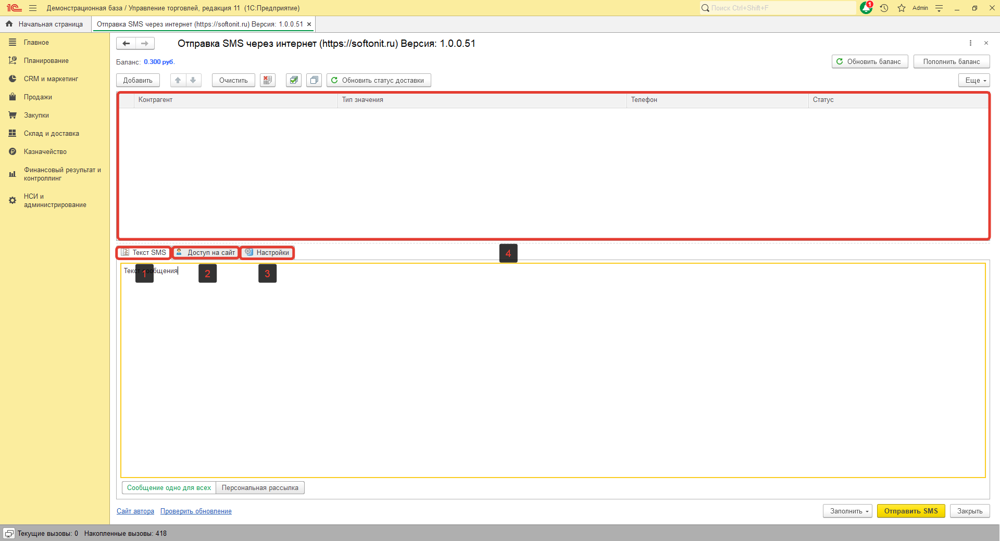
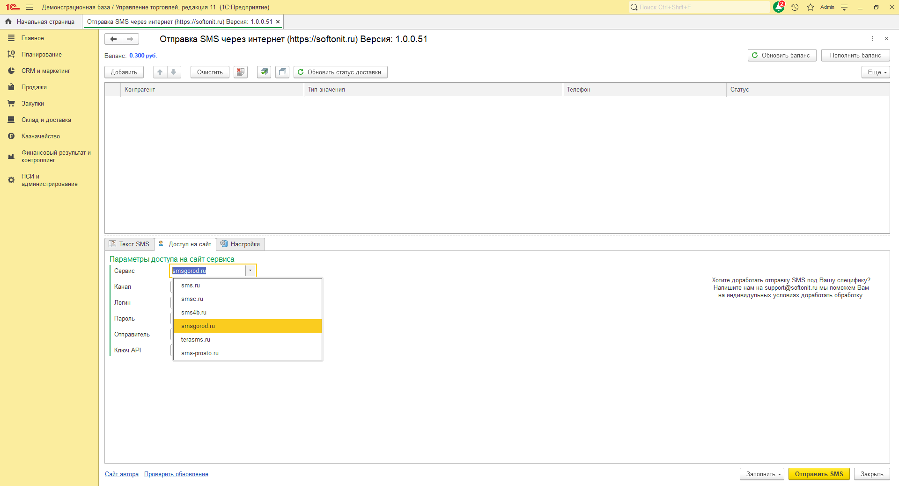
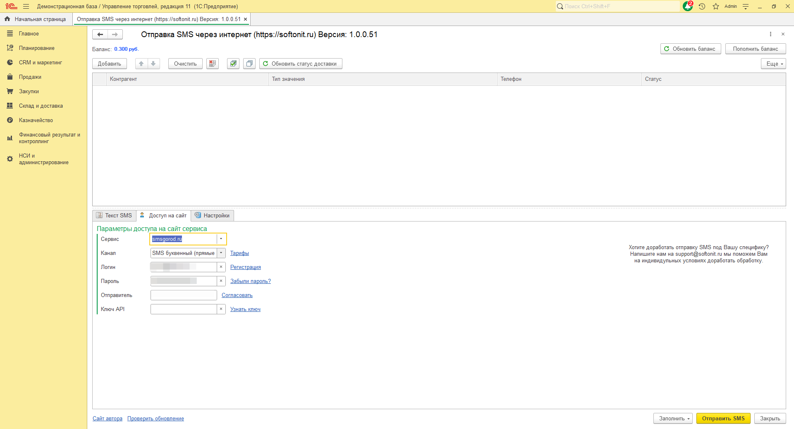
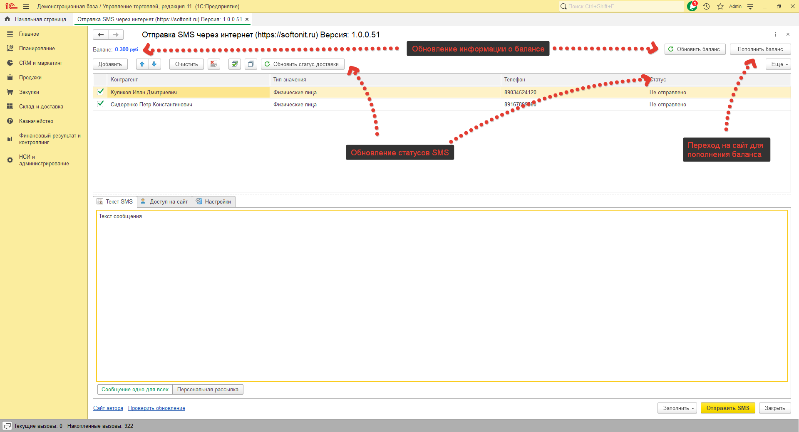

# Работа с сервисом smsgorod.ru

## Рассмотрим работу с обработкой на примере сервиса smsgorod.ru  

### Запустим нашу обработку.  
Перед нами открылось окно обработки где видим три основные вкладки и поле для заполнения получателей.

Первым делом перейдем на вкладку **"Доступ на сайт"** и в поле **"Сервис"** выберем `"smsgorod.ru"`

После чего заполним  поля **"Логин"**, **"Пароль"**, **"Отправитель"**(Он должен соответствовать отправителю созданному в личном кабинете сервиса)".

### Теперь можно заполнить список получателей, Это можно сделать двумя способами.

1. Через кнопку `"Заполнить"`.

2. Через кнопку `"Добавить"`.

Для проверки баланса и статуса SMS  и пополнения используйте соответствующие кнопки

