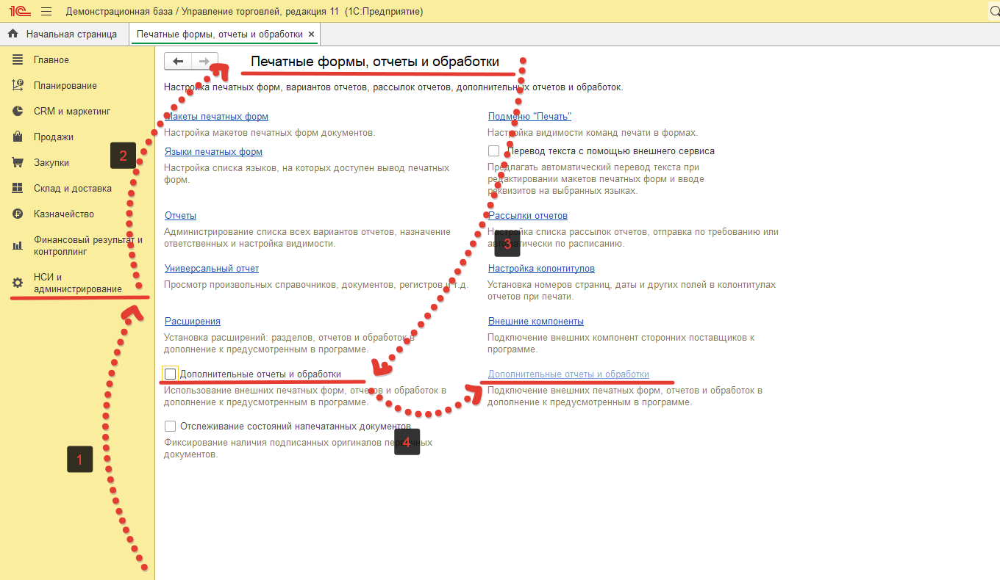
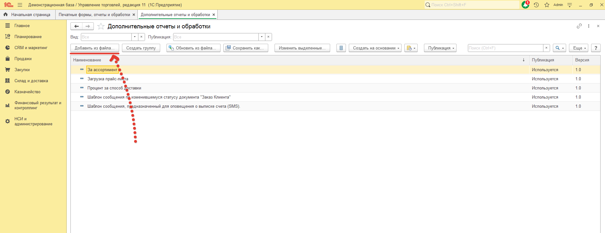
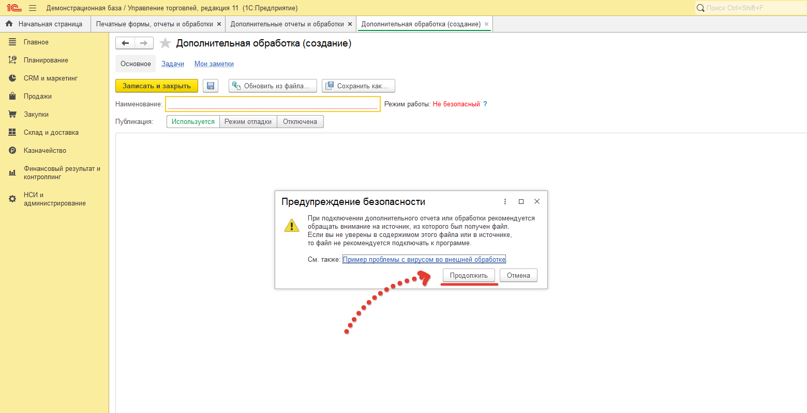
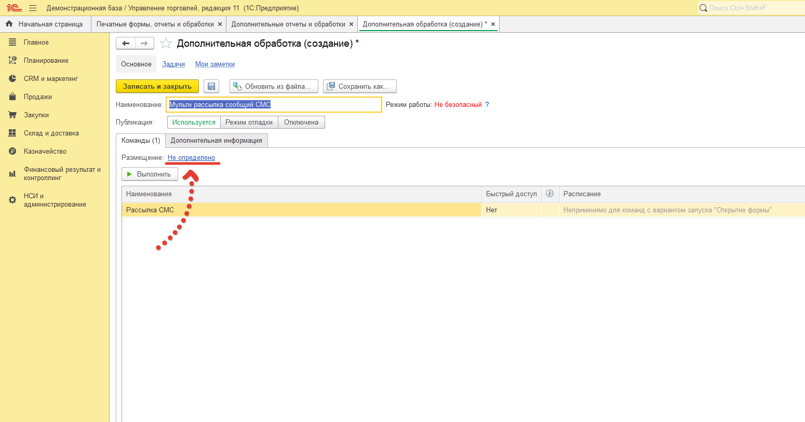
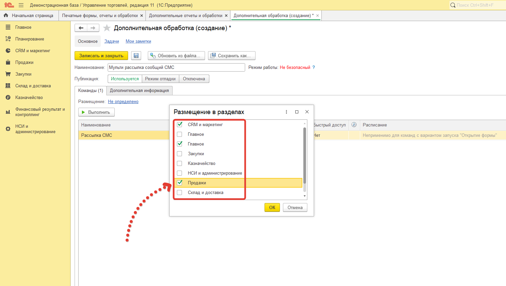
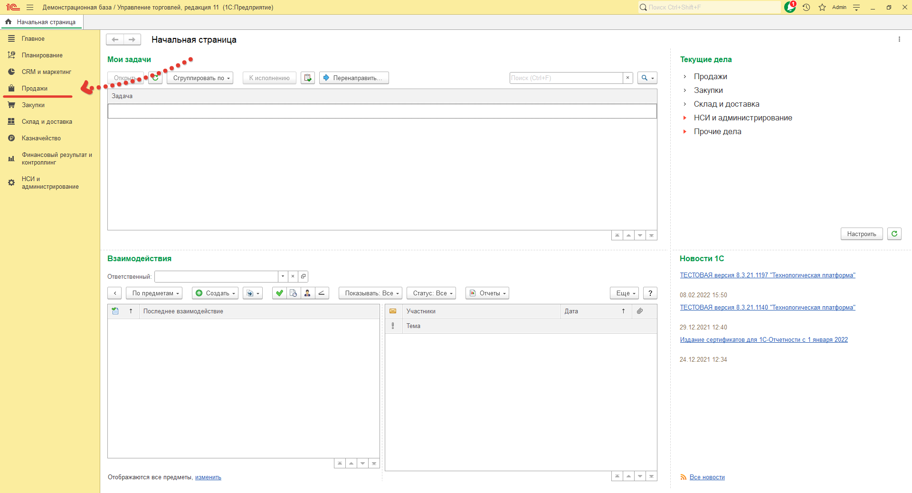
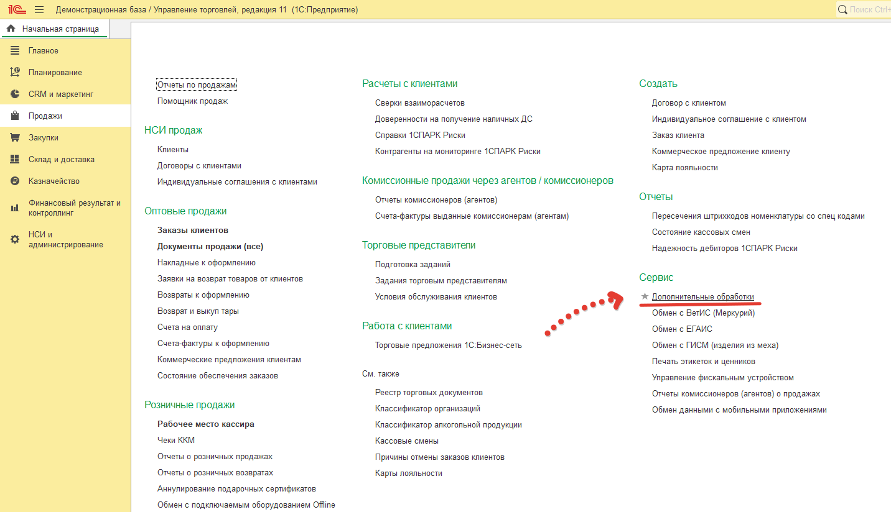
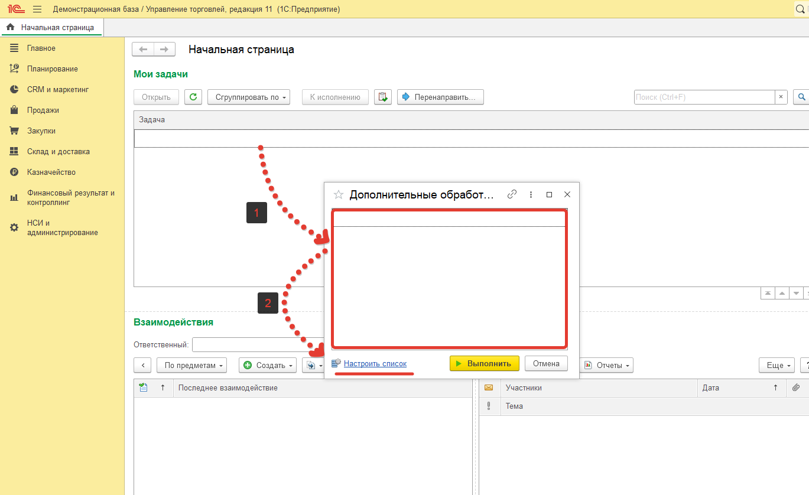
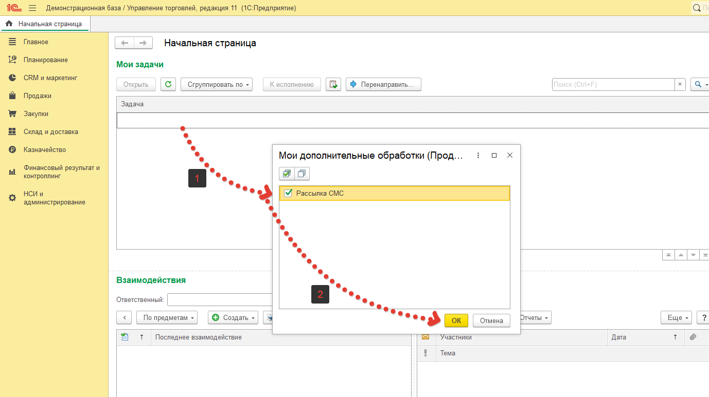
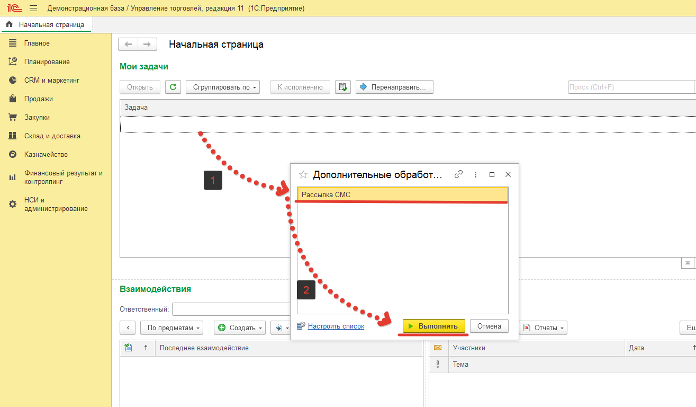

# Установка обработки "Мульти рассылка СМС из 1С"

## Для того чтобы можно было работать с обработкой в конфигурации, нам нужно сделать несколько простых шагов. В примере будем использовать конфигурацию "Управление торговлей 11.5":

1. Распакуйте архив с обработкой в папку.

2. Откройте НСИ и `«Администрирование»> «Печатные формы, отчеты и обработки»`.

3. Если не стоит флаг `«Дополнительные отчеты и обработки»`, то его нужно установить и перейти по гиперссылке `«Дополнительные отчеты и обработки»`.

4. В открывшемся окне нажать на кнопку `«Добавить из файла»`, так как мы работаем с внешней обработкой, система безопасности может запросить у нас подтверждение на дальнейшее подключение. После чего добавим файл из, распакованного ранее, архива.

5. Теперь нам нужно разместить обработку в подсистемах, для этого нажмем на соответствующую гиперссылку.

6. В открывшемся окне флагами отметим подсистемы куда мы хотим добавить нашу обработку, после чего нажимаем `"ОК"`.

7. Теперь можно закрыть окно, нажав на кнопку `"Записать и закрыть"`.

8. Так как при установке, мы указывали подсистему или подсистемы, где она должна быть  доступна, в нашем  примере это подсистема `«Продажи»`, в которую я и перехожу.

9. Дальше нажимаем `«Дополнительные обработки»`.

10. Мы видим, что данный список пуст. Для того чтобы в нем отображалась наша обработка нажмем `«Настроить список»` и установим флаг на нашей обработке и нажмем `«ОК»`.

11. Теперь она будет отображаться в данном списке, а если нажать на кнопку `«Выполнить»`, то запустится сама обработка.

## Поздравляю, наша обработка добавлена в конфигурацию и можно приступать к работе.